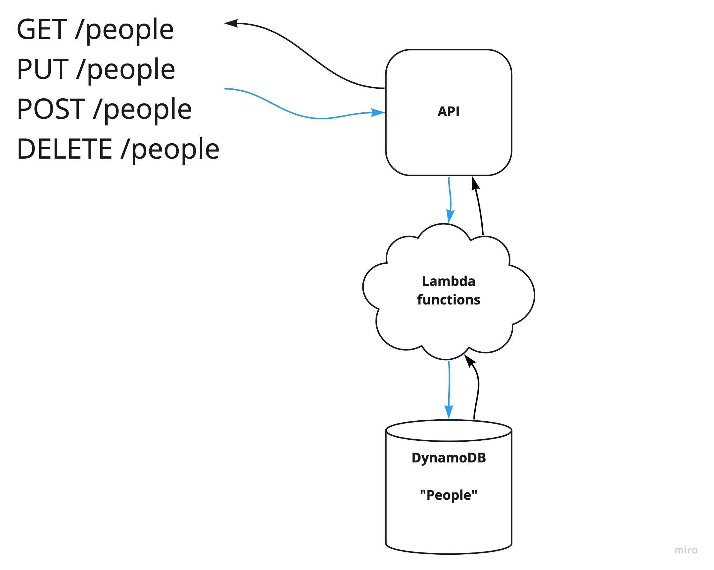

# LAB - AWS: API, Dynamo and Lambda

## Project: REST API

### Author: Brendan Smith

### Links and Resources

<!-- - [ci/cd](https://github.com/brendigler/cloud-server/actions) -->
- [deployed server url](https://c578qzkfed.execute-api.us-west-2.amazonaws.com/people)
- [Pull Request](https://github.com/brendigler/serverless-api/pull/1)

## Routes

### GET /people

Returns a json object containing all database entries. If a query string parameter of ID is passed, returns the database record for that entry.

### POST /people

Given a JSON request.body, adds a new entry to the people database with given parameters.

### PUT /people

Given a query string parameter of ID and request.body of a new user object, updates the database record of ID with the new given parameters.

### DELETE /people

Given a query string parameter of ID, deletes the database record of ID.

<!-- ### Setup -->
<!-- #### `.env` requirements -->

<!-- - `PORT` - Port Number
- `MONGODB_URI` - MongoDB URI -->

<!-- #### How to initialize/run your application -->
<!-- 
- clone to local repo
- `npm install`
- `npm start` -->

<!-- #### Tests -->

<!-- - Run tests with `npm test` -->

<!-- #### UML / Application Wiring Diagram -->

